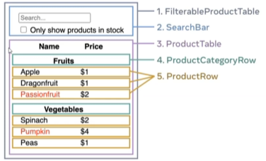
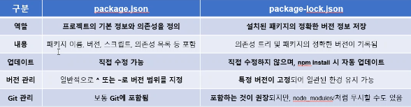
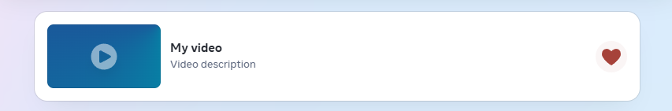
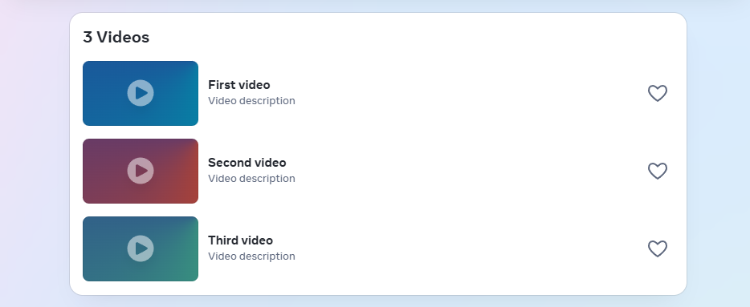
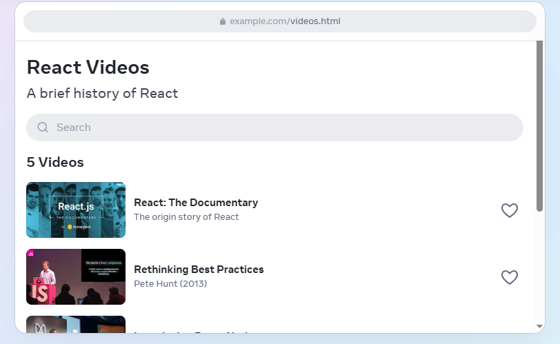
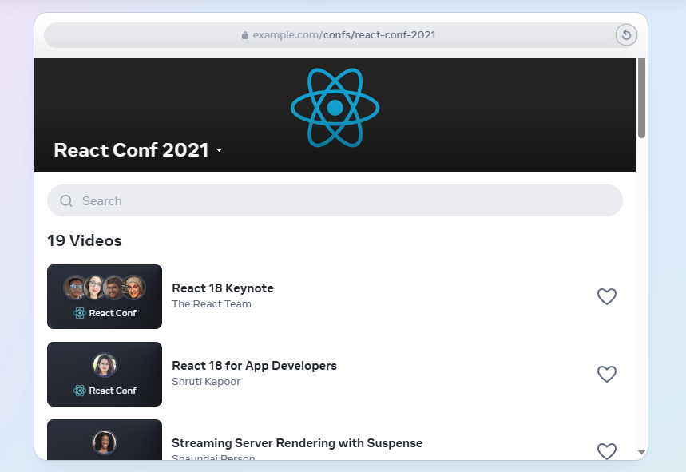
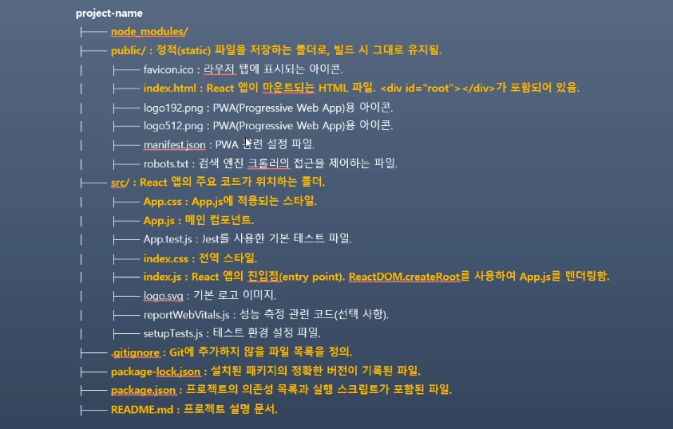

# 202030225 이동민 

## 2025-05-29

### React Server Components: RSC를 사용하면 빌드 타임, 서버 전용, 인터렉티브 컴포넌트를 단일 리액트 트리에 포함할 수 있음
* 단 성능은 향상시킬 수 있지만 유지 관련 지식이 팔요로 함께

### 처음부터 React 앱 만들기
- 콘텐츠의 첫 바이트를 로드하는 데 걸리는 시간(첫번째 바이트까지의 시간)
- 콘텐츠의 첫 번째 부분을 렌더링하는 데 걸리는 시간(첫번째 콘텐츠 페인트)
- 앱에서 가장 큰 표시 콘텐츠를 렌더링하는 데 걸리는 시간(가장 큰 콘텐츠 페인트) 줄일 수 있음

### 기존 프로젝트에 React 추가
- 기존 프로젝트에 인터랙티브 기능을 추가하고 싶다면 리액트로 프로젝트를 다시 작성할 필요는 없다
- 인터랙티브 기능이란 사용자와 시스템 간의 상호 작용을 가능하게 하는 기능을 말함
- 기존 스택에 리액트 추가하고 어디에서나 인터랙티브 리액트 컴포넌트를 렌더링

### 5-3. 기존 페이지의 일부분에 React 사용하기
1. JSX 구문을 사용할 수 있게 자바스크립트 환경을 설정하고 import / export 구문을 통해 코드를 모듈로 분리한 다음 npm 패키지 레지스트리의 패키지 사용
2. 해당 페이지에서 원하는 위치에 React 컴포넌트를 렌더링

## 2025-05-25

### 프로젝트에 도입하기 (Installation)
- 리액트는 점진적으로 적용할 수 있도록 설계되었으며 필요한 만큼 사용할 수 있음

### 리액트 시도하기
- 로컬에서 사용해 보고 싶다면 Node.js만 설치 하면 사용 가능
- 리액트 문서 외에도 CodeSandbox, StackBlitz, CodePen 등의 온라인 샌드박스에서 리액트를 지원
```javascript

function Greeting( name ) {
  return <h1>Hello, {name}</h1>;
}

export default function App() {
  return <Greeting name="World" />
}
```
### 새로운 리액트 앱 만들기
- 리액트로 새로운 앱이나 웹사이트를 구축하려면 프레임워크부터 시작하는 것이 좋음
- 앱에 기존 프레임워크에서 잘 제공되지 않는 제약 조건이 있거나 자체 프레임워크를 빌드하는 것을 선호하거나 리액트 앱의 기본 사항만 배우려는 경우 리액트 앱을 처음부터 빌드할 수 있음
* 풀스택 프레임워크: 권장 프레임워크들은 프로덕션에서 앱을 배포하고 확장하는 데 필요한 모든 기능을 지원
   
### Next.js (앱 라우터)
- Next.js의 앱 라우터는 리액트의 아키텍처를 최대한 활용하여 풀 스택 리액트 앱을 활성화하는 리액트 프레임워크
- Next.js는 Vercel에서 유지 관리함
- Next.js 앱을 빌드해서 Node.js와 서버리스 호스팅 혹은 자체 서버에 배포할 수 있음
- Next.js는 또한 서버가 필요 없는 정적 넘버나이트도 지원
- Vercel은 추가적으로 옵트-인 유료 클라우드 서비스도 지원
* Opt-in이란 사용자가 옵션을 직접 선택할 수 있도록 하는 서비스

### React Router (v7)
- React Router는 리액트에서 가장 인기있는 라우팅 라이브러리이며 Vite와 함께 사용하면 풀스택 React 프레임워크로 만들 수 있음
- 표준 Web API이며 다양한 자바스크립트 런타임과 플랫폼을 위한 준비된 배포 템플릿이 있다고 강조
- React Router는 Shopify에서 유지 관리함

### Expo (네이티브 앱용)
- Expo는 네이티브 UI를 사용하여 안드로이드, iOS, 웹을 위한 범용 앱을 만들 수 있는 React 프레임워크
- 네이티브 부분을 쉽게 사용할 수 있게 해주는 React Native SDK를 제공
- Expo는 **Expo(the company)**에서 유지 관리함
- Expo로 앱을 빌드하는 것은 무료이고 구글이나 앱스토어에 제한 없이 제출할 수 있음
- Expo는 추가적으로 옵트-인 유료 클라우드 서비스를 제공

### 풀스택 리액트 비전을 향해 나아가고 있는 또 다른 떠오르는 프레임워크들
- TanStack Start는 TanStack Router를 기반으로 하는 풀스택 React 프레임워크
- RedwoodJS는 쉽게 풀스택 웹 애플리케이션을 만들 수 있도록 사전설계된 패키지와 구성을 가진 풀스택 리액트 프레임워크

### 공통 애플리케이션 패턴 구축 
- 위에 나열된 빌드 도구는 클라이언트 전용 단일 페이지 앱(SPA)으로 시작하지만 라우트, 데이터 가져오기, 스타일링과 같은 일반적인 기능에 대한 추가 솔루션을 포함하지 않음
- React 생태계에는 이러한 문제를 해결하는 다양한 도구가 있음
- 더 나은 도구가 있다면 다른 도구를 선택해도 됨

###  Routing
- 라우팅은 사용자가 특정 URL을 방문할 때 표시할 콘텐츠나 페이지를 결정
앱의 여러 부분에 URL을 매핑하려면 라우터를 설정해야 함
- 또한 초기 로딩 경로, 경로 매핑방식, 쿼리 매개변수도 처리해야 함
- 라우터는 코드 내에서 구성하거나 구성 요소 폴더 및 파일 구조에 따라 정의할 수 있음

### 처음부터 React 앱 만들기
- 데이터 페치: 더 빠른 로딩을 위해 전체 페이지에 대한 데이터를 미리 페치하는 것 포함
- 코드 분할: 클라이언트 번들 크기를 최소화하기 위한 것
- 페이지 렌더링 방식: 각 페이지가 생성되는 방식을 결정하기 위한 것
이 포함
- 특별히 제작된 데이터 가져오기 라이브러리는 데이터를 가져오고 캐싱하는 어려운 작업을 대신 처리해 주므로 개발자는 앱에 필요한 데이터와 이를 표시하는 방법에 집중할 수 있음
- 이러한 라이브러리는 일반적으로 컴포넌트에서 직접 사용되지만 더 빠른 프리페칭과 더 나은 성능을 위해 라우터 로더에 통합되거나 서버 렌더링에도 사용할 수 있음
- 컴포넌트에서 직접 데이터를 가져오면 네트워크 요청 폭주로 인해 로딩 시간이 느려질 수 있으므로 라우터 로더나 서버에서 데이터를 미리 가져오는 것이 좋음
- 이렇게 하면 페이지가 표시될 때 페이지의 모든 데이터를 한 번에 가져올 수 있음

### 애플리케이션 성능 개선 
- 서버 사이드 렌더링(SSR) # SSG와 유사하지만 매 요청 시 서버에서 정적 페이지 생성
- 정적 사이트 생성(SSG) # 빌드 시 한 번에 모든 정적 페이지 생성
- React 서버 컴포넌트(RSC) # 서버에서 동작하는 컴포넌트로 DB 접근 등이 가능
와 같은 다른 렌더링 패턴을 구현해야 함


## 2025-05-15

### Step 3: 최소한의 데이터만 이용해서 완벽하게 UI State 표현하기
- 이 중 어떤 것이 state가 되어야 할까요? 
    - 아래의 세 가지 질문을 통해 결정할 수 있음
1. 시간이 지나도 변하지 않나요? 
    - 그러면 확실히 state가 아님
2. 부모로부터 props를 통해 전달됩니까? 
    - 그러면 확실히 state가 아님
3. 컴포넌트 안의 다른 state나 props를 가지고 계산 가능한가요? 
    - 그렇다면 절대로 state가 아님
  
- 제품의 원본 목록은 props로 전달되었기 때문에 state가 아님
- 사용자가 입력한 검색어는 시간이 지나며 따라 변하고 다른 요소로부터 계산될 수 없기 때문에 state로 볼 수 있음
- 체크박스의 값은 시간에 따라 바뀌고 다른 요소로부터 계산될 수 없기 때문에 state로 볼 수 있음
- 필터된 제품 목록은 원본 제품 목록을 받아서 검색어와 체크박스의 값에 따라 계산할 수 있으므로 state가 아님

### Step 4. state가 어디에 있어야 할 지 정하기
- 어떤 컴포넌트가 이 state를 소유하고 변경할 책임을 지게 할 지 정해야함
- 리액트는 항상 컴포넌트 계층구조를 따라 부모에서 자식으로 데이터를 전달하는 단방향 데이터 흐름을 사용함
- 앱을 구현하면서 어떤 컴포넌트가 state를 가져야 하는 지 바로 명확하지 않을 수 있음

1. 해당 state를 기반으로 렌더링하는 모든 컴포넌트를 찾아야 함
2. 그들의 가장 가까운 공통되는 부모 컴포넌트를 찾아야 함 - 계층에서 모두를 포함하는 상위 컴포넌트
3. state가 어디에 위치 돼야 하는 지 결정

### state가 어디에 위치 돼야 하는지 결정
1. 대개 공통 부모에 state를 그냥 두면 됨
2. 혹은 공통 부모 상위의 컴포넌트에 둬도 됨 
3. state를 소유할 적절한 컴포넌트를 찾지 못했다면 state를 소유하는 컴포넌트를 하나 만들어서 상위 계층에 추가

### Step 5: 역 데이터 흐름 추가하기
- 이제 사용자 입력에 따라 state를 변경하려면 반대 방향의 데이터 흐름을 만들어야함
- 이를 위해서는 계층 구조의 하단에 있는 컴포넌트에서 FilterableProductTable의 state를 업데이트할 수 있어야함
- 리액트는 데이터 흐름을 명시적으로 보이게 만들어줌
- 그러나 전통적인 양방향 데이터 바인딩보다 조금 더 많은 타이핑이 필요함
- 4단계의 예시에서 체크하거나 키보드를 타이핑할 경우 UI의 변화가 없고 입력을 무시하는 것을 확인할 수 있음
- 이것은 의도적으로 `<input value={filterText} />`로 코드를 쓰면서 value라는 prop이 항상 FilterableProductTable의 filterText라는 state를 통해서 데이터를 받도록 정했기 때문

```javaScript
function FilterableProductTable({ products }) {
  const [filterText, setFilterText] = useState('');
  const [inStockOnly, setInStockOnly] = useState(false);

  return (
    <div>
      <SearchBar
        filterText={filterText}
        inStockOnly={inStockOnly}
        setFilterTextChange={setFilterText}
        setInStockOnlyChange={setInStockOnly}
      />
    </div>
  );
}
```
- filterText라는 state가 변경되는 것이 아니기 때문에 input의 value는 변하지 않고 화면도 바뀌는 것이 없음
- 우리는 사용자가 input을 변경할 때마다 사용자의 입력을 반영할 수 있도록 state를 업데이트하기를 원함
- state는 FilterableProductTable이 가지고 있고 state 변경을 위해서는 setFilterText와 setInStockOnly를 호출을 하면 됨
- SearchBar가 FilterableProductTable의 state를 업데이트할 수 있도록 하려면, 이 함수들을 SearchBar로 전달
```javaScript
function SearchBar({
  filterText,
  inStockOnly,
  onFilterTextChange,
  onInStockOnlyChange
}) {
  return (
    <form>
      <input
        type="text"
        value={filterText}
        placeholder="Search..."
        onChange={(e) => onFilterTextChange(e.target.value)}
      />
      <label>
        <input
          type="checkbox"
          checked={inStockOnly}
          onChange={(e) => onInStockOnlyChange(e.target.checked)}
        />
        {' '}
        Only show products in stock
      </label>
    </form>
  );
}
```
- SearchBar에서 onChange 이벤트 핸들러를 추가하여 부모 state를 변경할 수 있도록 구현할 수 있음


## 2025-05-08

### 리액트로 사고하기
- 리액트를 사용하게 되면 우리가 고려라고 있는 디자인이나 만들 앱들에 대한 생각을 바꿀 수 있음
- 리액트로 사용자 인터페이스를 발드할 때 먼저 이걸 컴포넌트 조각으로 나눔
- 그리고 각 컴포넌트의 다양한 시각적 상태들을 정의
- 마지막으로 컴포넌트들을 연결하여 데이터가 그 사이를 흘러가게 함

### STEP 1: UI를 컴포넌트 계층으로 쪼개기
  - 먼저 모든 시안에 있는 모든 컴포넌트와 하위 컴포넌트 주변에 박스를 그리고 그들에게 이름을 붙이면서 시작
  - JSON이 잘 구현됐다면 자연스럽게 데이터 모델에 대응한다는 것을 발견할 수 있음

  1. FilterableProductTable (회색): 예시 전체를 포괄
  2. SearchBar (파란색): 사용자의 입력을 받음
  3. ProductTable (라벤더색): 데이터 리스트를 보여주고, 사용자의 입력을 기반으로 필터링
  4. ProductCategoryRow (초록색): 각 카테고리의 헤더를 보여줌
  5. ProductRow (노란색): 각각의 제품에 해당하는 행을 보여줌

  

  ### Step 2: React로 정적인 버전 구현하기
  - 이제 컴포넌트 계층구조가 만들어졌으니, 앱을 실제로 구현해 볼 시간임
  - 가장 쉬운 접근 방법은 상호작용 기능은 아직 추가하지 않고, 데이터를 모델로부터 UI를 렌더링하는 버전을 만드는 것
  - 대체로 먼저 정적인 버전을 만들고 상호작용 기능을 추가하는 게 더 쉬움
  - 정적 버전을 만드는 것은 많은 타이핑이 필요하지만 생각할 것은 적음
  - 반대로 상호작용 기능을 추가하는 것은 많은 생각이 필요하지만 타이핑은 그리 많이 필요하지 않음
  - 데이터를 모델을 렌더링하는 앱의 정적인 버전을 만들기 위해서는 다른 컴포넌트를 재사용하고 props를 이용하여 데이터를 넘겨주는 컴포넌트를 구현하는 것이 좋음
  - props는 부모가 자식에게 데이터를 넘겨줄 때 사용할 수 있는 방법
  -앱을 만들 때 계층 구조에 따라 상층부에 있는 컴포넌트 즉 FilterableProductTable부터 시작하는 **하향식(top-down)**으로 만드는 방법이 있음
  - 또는 하층부에 있는 컴포넌트인 5. ProductRow부터 **상향식(bottom-up)**으로 만들 수도 있음
  - 간단한 예시에서는 보통 하향식으로 만드는 게 쉽지만 프로젝트가 커지면 상향식으로 만들고 테스트를 작성하면서 개발하기가 더 쉬움
  - 이 단계가 끝나면 데이터 렌더링을 위해 만들어진 재사용 가능한 컴포넌트들의 라이브러리를 가지게 됨
  - 현재는 앱의 정적 버전이기 때문에 컴포넌트는 단순히 JSX만 리턴
  - 계층구조의 최상위 컴포넌트(FilterableProductTable)는 prop으로 데이터 모델을 받음
  - 이는 데이터가 최상위 컴포넌트부터 트리의 맨 아래까지 흘러가기 때문에 단방향 데이터 흐름이라고 부릅

  ### Step 3: 최소한의 데이터만 이용해서 완벽하게 UI State 표현하기
  - UI를 상호작용하게 만들려면 사용자가 기반 데이터 모델을 변경할 수 있게 해야 함
  - 리액트는 state를 통해 기반 데이터 모델을 변경할 수 있게 함
  - state는 앱이 기억해야 하는 변경할 수 있는 데이터의 최소 집합이라고 생각
  - state를 구조화 하는 데 가장 중요한 원칙은 중복배제원칙
  - 애플리케이션에 필요한 가장 최소화된 state를 파악하고 나머지 모든 것들은 필요에 따라 실시간으로 계산해야 함
  - UI에 상품 아이템의 개수를 노출하고 싶다면 상품 아이템 개수를 따로 state 값으로 가지는 게 아니라 단순하게 배열의 길이만 쓰면 됨


## 2025-04-18

### 화면이 한 줄로 깨져서 보이는 이유
- square 컴포넌트에서 <button>을 <div>로 감싸서 생기는 문제
- 이 경우는 <>...</>로 감싸거나 <button>만 남기면 됨
- React Fragment를 사용하면 구조도 깔끔하고 유지보수도 편함

`Square.js`
```Javascript
export default function Square({ value, onSquareClick }) {
  return (
    <>
      <button className="square" onClick={onSquareClick}>
        {value}
      </button>
    </>
  );
}
```

### 과거 움직임 보여주기
- <button>과 같은 리액트 엘리먼트는 일반 자바스크립트 객체이므로 에플리케이션에서 전달할 수 있음
- 리액트에서 여러 엘리먼트를 렌더링하면 리액트 엘리먼트 배열을 사용할 수 있음
- 이미 state에 이동 history 배열이 있기 때문에 이것을 리액트 엘리먼트 배열로 변환해야 함
- 자바스크립트에서 한 배열을 다른 배열로 변환하려면 배열 map 매서드를 사용하면 됨

```javascript
[1,2,3].map((x) => x * 2) // [2, 4, 6]
```

### map함수의 사용

```javascript
const moves = history.map((squares, move) = > { })
```
- map의 기본 구문은 map(callbackFn) 혹은 map(callbackFn, thisArg) 임
- thisArg는 내부에서 this로 사용할 값을 지정하는데 화살표 함수에서는 생략
- squares, move는 화살표 함수의 매개변수
1. 원본 배열 (history): map이 호출된 원본 배열
2. 원본 배열의 인덱스 (move): 현재 순환 중인 원본 배열 요소의 인덱스
3. 요소 값 (squares): 현재 순회 중인 요소 배열의 값

각각의 history 요소에 대한 { }의 실행문(후작업) 실행 -> moves객체에 저장 -> 최종 출력에 사용

### Key 선택하기
- key는 리액트에서 특별하게 미리 지정된 프로퍼티
- 엘리먼트가 생성되면 리액트는 key 프로퍼티를 추출하여 반환되는 엘리먼트에 직접 key를 저장
- key가 props로 전달되는 것처럼 보일수 있지만 리액트는 자동으로 key를 사용해 업데이트 할 컴포넌트를 결정
- key가 지정되지 않은 경우 리액트는 경고를 표시하며 배열의 인덱스를 기본 key로 사용
- 베열 인덱스를 key로 사용하면 리스트 항목의 순서를 바꾸거나 항목을 추가/제거할 때 문제가 발생
- 동적인 리스트를 만들때마다 적절한 key를 할당하는 것을 추천
- 명시적으로 `key={i}`를 전달하면 경고는 사라지지만 배열의 인덱스를 사용할 때와 같은 문제가 발생하므로 대부분은 추천하지 않음


## 2025-04-17

### state 끌어올리기
- Board가 모든 State를 관리하므로 부모 Baord 컴포넌트는 자식 square 컴포넌트가 올바르게 표시될 수 있도록 props를 전달
- Square 클릭하면 자식 Square 컴포넌트가 부모 Board 컴포넌트에 Board의 state를 업데이트 하도록 요청
- Board의 state가 변경되면 Board 컴포넌트와 모든 자식 Square 컴포넌트가 자동으로 다시 렌더링 됨
- Board 컴포넌트에 속한 모든 Square의 state를 유지하면 나중에 승자를 결정 할 수 있음

### state 끌어올리기 (중요)
- DOM <button> 엘리먼트의 onClick 속성은 빌트인 컴포넌트이기 때문에 리액트에서 특별한 의미를 갖음
- 사용자 정의 컴포넌트
- Square의 onSquareClick prop나 Board의 handleClick 함수에 어떠한 이름을 붙여도 코드는 동일하게 작동
- 리액트에서는 주로 이벤트를 나타내는 prop에는 onSomething과 같은 이름을 사용하고, 이벤트를 처리하는 함수를 정의 할 때는 handleSomething과 같은 이름을 사용

### 불변성이 왜 중요할까
- 불변성을 사용하면 복잡한 기능을 훨씬 쉽게 구현할 수 있음
- 기본적으로 부모 컴포넌트의 state가 변경되면 모든 자식 컴포넌트가 자동으로 다시 렌더링 됨
- 여기에 변경사항이 없는 자식 컴포넌트도 포함되기에 트리의 영향을 받지 않는 부분은 리렌더링을 피하는 것이 좋음
- 불변성을 사용하면 컴포넌트가 데이트의 변경 여부를 저렴한 비용으로 판단할 수 있음

### return의 의미
- 자바스크립트에서 return값이 없는 return;은 함수를 즉시 종료하라는 의미
- 이때 값을 반환하지 않으면 자동으로 undefined를 반환

### 구조 분해 할당
- 비구조화 할당, 구조화 할당이라고도 번역되지만 구조 분해 할당을 많이 사용
- 구화 분해 할당은 배열이나 객체의 구조를 해체하여 내부 값을 개별 변수에 쉽게 할당하는 방법 입니다
- 코드의 간결성과 가독성을 높일 수 있음
- map함수에서도 사용되는 방법

### props를 통해 데이터 전달하기
- 리액트의 component architecture를 사용해서 재사용할 수 있는 컴포넌트를 만들어서 중복된 코드를 삭제

### 사용자와 상호작용하는 컴포넌트 만들기
- 컴포넌트는 무언가 기억하기 위해 state 사용

## state 끌어올리기
- 여러 자식 컴포넌트 데이터를 수집하거나 두 자식 컴포넌트가 서로 통신하도록 하려면, 부모 컴포넌트에서 공유 state를 선언해야 함
- 부모 컴포넌트는 props를 통해 해당 state를 자식 컴포넌트에 전달할 수 있음
- 이렇게 하면 자식 컴포넌트가 서로 동기화되고 부모 컴포넌트와도 동기화 되도록 할 수 있음


### 이벤트에 응답하기
- 컴포넌트 내부에 event handler 함수를 선언하면 이벤트에 응답할 수 있음
- onClick={handleClick}의 끝에 소괄호가 없는 것을 주목
- 함수를 호출하지 않고 전달만 하면 됨
- 리액트는 사용자가 버튼을 클릭할때 이벤트 헨들러를 호출

`MyButton.js`
```javascript
export default function MyButton() {
  function handleClick() {
    alert('You clicked me')
  }
  
  return (
    <button onClick={handleClick}>
      I'm a button component
    </button>
  );
}
```

### 화면 업데이트하기
- 컴포넌트가 특정 정보를 기억해 두었다가 표시하기를 원하는 경우가 있습니다
- 예를 들어 버튼이 클릭된 횟수를 세고 싶을 수 있는데 그렇게 할 때는 state를 추가하면 됨

```javascript
import { useState } from 'react';
```
- 리액트에서 useState를 import함
- 보면 useState는 리액트 파일 안에 Named Exports로 선언되어 있는 여러 개의 컴포넌트중 하나라는 것을 알 수 있음
- 컴포넌트 내부에 state 변수를 선언할 수 있음
- useState로부터 현재의 state를 지정할 수 있는 변수인 count와 이를 업데이트할 수 있는 함수인 setCount를 얻을 수 있음
- 변수 이름과 변수 이름 앞에 set을 붙인 업데이트 함수를 관용적으로 사용

`CountState.js`
```javascript
import { useState } from 'react'

export default function CountState() {
  const [count, setCount] = useState(0);

  function handleClick() {
    setCount(count + 1)
  }

  return (
    <div>
      <button onClick={handleClick}>
        Clicked {count} times
      </button>
    </div>
  )
}
```

### Hook 사용하기
- use로 시작하는 함수를 Hook이라고 함
- useState는 리액트에서 제공하는 내장 Hook임
- 기존의 것들을 조합하여 자신만의 Hook을 작성할 수 있음

### Hooks의 사용 규칙
1. 최상위에서만 호출해야 함
2. 리액트 함수형 컴포넌트 또는 사용자 Hook 내부에서만 사용 가능
  - 일반적인 자바스크립트 함수에서 useState, useEffect 등의 Hook을 사용할 수 없음

### 이런 제한이 필요한 이유
1. 렌더링 순서를 보장하기 위해서
2. 불필요한 사이드 이펙트 방지

### function형 컴포넌트에서만 Hook을 사용하는 이유
- 과거에는 Class형 컴포넌트는 lifecycle 함수를 통해서 상태를 관리 했음
- 유지보수가 어렵고 복잡해질 수 있었음
- 리액트는 상태관리와 로직을 더 간결하게 만들기 위해 Hooks를 도입
- 리액트 팀은 function형 컴포넌트를 권장하고 있음
- Hook은 function형 컴포넌트 전용으로 설계됨


### Component의 생성 및 nesting
- React는 component로 만들어짐
- component는 버튼처럼 작을 수도 있고 전체 페이지처럼 클 수도 있음
- component는 마크업을 반환하는 JavaScript 함수
- 중첩은 Css 선택자의 중첩 구조를 생각하면 쉽게 이해할 수 있음

`App.js`
```Javascript
function MyButton() {
  return (
    <button>
      I'm a button
    </button>
  );
}

export default function MyApp() {
  return (
    <div>
      <h1>Welcome to my app</h1>
      <MyButton />
    </div>
  );
}
```
### export default
- 파일내의 컴포넌트중 기본 컴포넌트를 지정
- JS 문법

### export default 선언 위치는 어디가 좋을까
- 공식 문서처럼 main component의 function 키워드 왼쪽에 선언하는게 좋음
- 한 파일에 여러개 컴포넌트가 있을때 가독성에 좋음

### Named Exports (export)
- 하나의 파일안에 여러 개의 컴포넌트가 있을때 사용
- 컴포넌트를 사용하는 쪽에서는 컴포넌트 정확한 이름을 명시

### Default Exports
- 하나의 파일안에서 하나의 컴포넌트만 내보내는 경우 사용
- 컴포넌트 사용하는 쪽에너는 컴포넌트 정확한 이름을 반드시 명시해야 함

`App.js`
```javascript
import MyB from "./MyButton"

export default function MyApp() {
  return (
    <div>
      <h1>Welcome to my app</h1>
      <MyB />
    </div>
  );
}
```
MyButton.js
```javascript
export default function MyButton() {
  return (
    <button>I'm a button component</button>
  );
}
```
`App.js`
```javascript
import MyB from "./MyButton"
import { Button1, Button3 } from "./BottonLib";

export default function MyApp() {
  return (
    <div>
      <h1>Welcome to my app</h1>
      <MyB /><br />
      <Button1 />&nbsp;
      <Button3 />
    </div>
  );
}
```
`ButtonLib.js` (중첩)
```javascript
function Button1() {
  return (
    <button>Button1</button>
  )
}
function Button2() {
  return (
    <button>Button2</button>
  )
}
function Button3() {
  return (
    <button>Button3</button>
  )
}

export { Button1, Button2, Button3 }
```
### JSX로 마크업 작성하기
- 반드시 써야 하는 것은 아니지만 리액트 프로젝트에서는 편의성을 위해 JSX를 사용
- JSX는 HTML보다 엄격한 문법 적용
- JSX에서는 <br /> 같이 싱글 태그를 닫아야 합니다
- React 에서는 여러 개의 컴포넌트를 JSX 태그로 반환할 수 있음 

`AboutPage.js`
```Javascript
export default function AboutPage() {
  return (
    <>
      <h1>About Page</h1>
      <p>Hello!!!</p>
    </>
  )
}
```

### 스타일 추가하기
- 리액트에서는 className으로 css 클래스를 지정
- className은 HTML의 class 속성과 동일한 방식으로 동작

## 데이터 표시하기
- JSX를 사용하면 자바스크립트에 마크업을 넣을 수 있음 (Js안의 마크업 안에 JS를 넣는다는게 더 정확한 표현)
- JSX 코드 내에서 JavaScript로 탈출하여 변수나 표현식을 사용하는 것

`Profile.js`
```javascript
import './Profile.css'

const user = {
  name: 'Hedy Lamarr',
  imageUrl: 'https://i.imgur.com/yXOvdOSs.jpg',
  imageSize: 90,
};

export default function Profile() {
  return (
    <>
      <h1>{user.name}</h1>
      
    </>
  );
}
```
`Profile.css`
```css
.avatar {
  border-radius: 50%;
}
```
### 리스트 렌더링하기
- 컴포넌트 리스트를 렌더링하기 위해서는 for문 및 map() 함수와 같은 자바스크립트 기능 사용
- 목록을 사용 할 때는 각 항목에 대해 고유하게 식별하는 문자열 또는 숫자를 전달해야 함
- 항목을 삽입, 삭제 또는 재정렬할 때 어떤 일이 일어났는지 알기 위해 key를 사용

`Shopping.js`
```javascript
const products = [
  { title: 'Cabbage', isFruit: false, id: 1 },
  { title: 'Garlic', isFruit: false, id: 2 },
  { title: 'Apple', isFruit: true, id: 3 },
];

export default function ShoppingList() {
  const listItems = products.map(product =>
    <li
      key={product.id}
      style={{
        color: product.isFruit ? 'magenta' : 'darkgreen'
      }}
    >
      {product.title}
    </li>
  );

  return (
    <ul>{listItems}</ul>
  );
}
```

### React Project의 구조 및 역할

- node_modules 
  - 초기 node module 및 새로 설치하는 패키지가 저장됨
  - 초기 파일 37,352 / 폴더 4,579 / 용량은 200MB로 엄청난 양의 파일이 존재
  - git으로 관리하지 않기 때문에 디렉토리 이름이 흐릿하게 나와잇는거 확인 할 수 있음

- public/ 
  - 정적 파일을 저장하는 디렉토리
  - 빌드 후 배포할 HTML, Css, JavaScript 등 보관되는 곳
  - 개발하면서 특별히 수정할 코드는 X

- src/ 
  - React 프로젝트의 주요 코드가 위치하는 디렉토리

- src/App.js
  - 메인 컴포넌트로 필요한 서브 컴포넌트를 모아서 관리

- src/App.css
  - App.js에 적용되는 스타일을 정의하는 파일

- src/index.js
  - React 앱의 진입 점으로 최종 렌더링의 되는 곳
  - ReactDom.createRoot를 사용하여 App.js를 렌더링

- src/index.css
  - 전역 스타일을 정의하는 파일

### 의존성 관리와 package.json

  - package.json은 패키지의 의존성을 관리하는 파일
  - 의존성이란 하나의 소프트웨어가 다른 소프트웨어에 의존하여 동작하는 관계 
  - 협업을 할 때는 팀원들 각자의 컴퓨터에 같은 패키지들을 설치하여 동일한 환경을 구성해야 함
  - 의존성을 무시하면 다른 버전의 패키지를 설치하는 팀원 때문에 오류가 발생할 수 있음

### 의존성을 관리하는 이유
  1. 손쉬운 설치 및 업데이트
  2. 일관된 개발 환경 유지
  3. 중복 설치 방지

### package.json의 의존성 내용과 종류
  1. dependencies: 실제 코드에서 사용하는 라이브러리
  2. devDependencies: 개발할 때만 필요한 라이브러리들
  3. peerDependencies: 필요한 라이브러리지만, 직접 설치하지 않고 사용자에게 맡기는 경우
  4. optionalDependencies: 있어도 되고 없어도 되는 선택적 의존성

### package.json와 package-lock.json의 차이



### package.json을 유지하는 이유
  1. 프로젝트의 의존성 정보 제공
  2. 버전 범위 설정 가능
  3. 스크립트와 메타데이터 저장
  4. 새로운 패키지 설치 및 관리

### node_module의 재설치
  - 클론을 받은 프로젝트의 경우
```
$ npm install
```

### 오류나 의존성 등의 문제가 생겼을 경우
  1. node modules 폴더와 package-lock.json 파일 삭제
  ```
  $ rm -rf node_modules package-lock.json
  ```
  2. npm 패키지의 임시 저장소인 캐시를 초기화 
  ```
  $ npm cache clean --force
  ```
  3. 패키지를 다시 설치
  ```
  $ npm install
  ```

### package-lock.json을 삭제하는 이유
  1. package-lock.json 손상되었거나 잘못된 의존성이 있을때
  2. 최신 버전의 패키지를 다시 받고 싶을때
  3. 팀프로젝트에서 다른 팀원이 이상한 상태로 package-lock.json을 업데이트 했을때

### 컴포넌트를 사용한 유저 인터페이스 생성
  - React를 사용하면 component라고 하는 개별 조각으로 사용자 인터페이스를 구축할 수 있음 

  Video.js 
  ``` Javascript
  function Video({ video }) {
  return (
    <div>
      <Thumbnail video={video} />
      <a href={video.url}>
        <h3>{video.title}</h3>
        <p>{video.description}</p>
      </a>
      <LikeButton video={video} />
    </div>
  );
}
```



### 컴포넌트를 작성하는 JavaScript와 마크업
  - React 컴포넌트는 자바스크립트 함수
  - 조건부로 내용을 표시하려면 if문 사용 가능
  - 목록을 표시하려면 배열에 map() 사용 가능

VideoList.js
``` javascript
function VideoList({ videos, emptyHeading }) {
  const count = videos.length;
  let heading = emptyHeading;
  if (count > 0) {
    const noun = count > 1 ? 'Videos' : 'Video';
    heading = count + ' ' + noun;
  }
  return (
    <section>
      <h2>{heading}</h2>
      {videos.map(video =>
        <Video key={video.id} video={video} />
      )}
    </section>
  );
}
```



- 이 마크업 구문을 JSX라 부름
- React에 의해서 대중화된 자바스크립트 구문의 확장
- 컴포넌트를 쉽게 만들고 관리하고 삭제할 수 있음

### 필요한 곳에 상호작용 요소 추가하기
  - 컴포넌트는 데이터를 받고 화면에 표시할 내용을 반환
  - 사용자가 입력란에 입력하는 것과 같이 상호작용에 응답하여 새 데이터를 전달할 수 있음
  - 그 후 새 데이터와 일치하도록 화면을 업데이트

SearchableVideoList.js
```javascript
import { useState } from 'react';

function SearchableVideoList({ videos }) {
  const [searchText, setSearchText] = useState('');
  const foundVideos = filterVideos(videos, searchText);
  return (
    <>
      <SearchInput
        value={searchText}
        onChange={newText => setSearchText(newText)} />
      <VideoList
        videos={foundVideos}
        emptyHeading={`No matches for “${searchText}”`} />
    </>
  );
}
```


### 프레임워크를 통해 풀스택으로 만들기
  - React는 라이브러리이므로 컴포넌트를 조합할 수 있지만 데이터를 가져오지는 못함
  - React로 완전한 서비스 제작하려면 Next.js 또는 리믹스 같은 풀스택 프레임워크 추천

confs/[slug].js
```javascript
import { db } from './database.js';
import { Suspense } from 'react';

async function ConferencePage({ slug }) {
  const conf = await db.Confs.find({ slug });
  return (
    <ConferenceLayout conf={conf}>
      <Suspense fallback={<TalksLoading />}>
        <Talks confId={conf.id} />
      </Suspense>
    </ConferenceLayout>
  );
}

async function Talks({ confId }) {
  const talks = await db.Talks.findAll({ confId });
  const videos = talks.map(talk => talk.video);
  return <SearchableVideoList videos={videos} />;
}
```


- React는 아키텍처이기도 함
- 프레임워크는 서버에서 실행되는 비동기 컴포넌트 또는 빌드 중 실행되는 비동기 컴포넌트에서 데이터를 가져올 수 있도록 함
- 파일이나 DB에서 데이터를 읽고 상호작용하는 컴포넌트에 전달할 수 있음

## 2025-03-13

### Node.JS 
  - 장점
  1. 비동기는 블로킹 I/O로  높은 성능 제공
  2. 풀스택 개발 가능
  3. NPM의 방대한 생태계 활용 가능
  4. 경량 서버 개발에 적합
  5. 실시간 데이터 처리에 강력

  - 단점
  1. CPU 집약적인 작업에 부적합
  2. 보안에 취약

### React Project 생성
```
npx create-react-app 이름
bash 터미널에서 디렉토리 변경
npm run start
```
### React Project의 구조 및 역할
