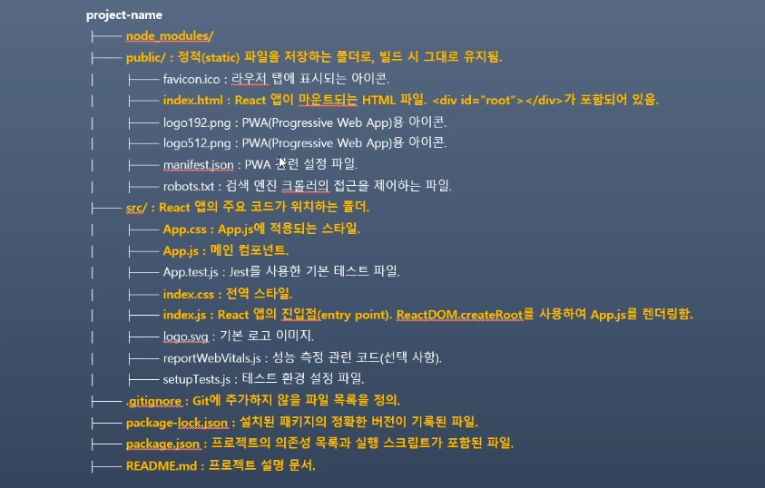

# 202030225 이동민 

## 2025-03-20
### React Project의 구조 및 역할

- node_modules 
  - 초기 node module 및 새로 설치하는 패키지가 저장됨
  - 초기 파일 37,352 / 폴더 4,579 / 용량은 200MB로 엄청난 양의 파일이 존재
  - git으로 관리하지 않기 때문에 디렉토리 이름이 흐릿하게 나와잇는거 확인 할 수 있음

- public/ 
  - 정적 파일을 저장하는 디렉토리
  - 빌드 후 배포할 HTML, Css, JavaScript 등 보관되는 곳
  - 개발하면서 특별히 수정할 코드는 X

- src/ 
  - React 프로젝트의 주요 코드가 위치하는 디렉토리

- src/App.js
  - 메인 컴포넌트로 필요한 서브 컴포넌트를 모아서 관리

- src/App.css
  - App.js에 적용되는 스타일을 정의하는 파일

- src/index.js
  - React 앱의 진입 점으로 최종 렌더링의 되는 곳
  - ReactDom.createRoot를 사용하여 App.js를 렌더링

- src/index.css
  - 전역 스타일을 정의하는 파일

### 의존성 관리와 package.json

- package.json은 패키지의 의존성을 관리하는 파일
- 의존성이란 하나의 소프트웨어가 다른 소프트웨어에 의존하여 동작하는 관계 
- 협업을 할 때는 팀원들 각자의 컴퓨터에 같은 패키지들을 설치하여 동일한 환경을 구성해야 함
- 의존성을 무시하면 다른 버전의 패키지를 설치하는 팀원 때문에 오류가 발생할 수 있음

### 의존성을 관리하는 이유
  - 손쉬운 설치 및 업데이트
  - 일관된 개발 환경 유지
  - 중복 설치 방지


## 2025-03-13
### Node.JS 
  - 장점
  1. 비동기는 블로킹 I/O로  높은 성능 제공
  2. 풀스택 개발 가능
  3. NPM의 방대한 생태계 활용 가능
  4. 경량 서버 개발에 적합
  5. 실시간 데이터 처리에 강력

  - 단점
  1. CPU 집약적인 작업에 부적합
  2. 보안에 취약

### React Project 생성
```
npx create-react-app 이름
bash 터미널에서 디렉토리 변경
npm run start
```
### React Project의 구조 및 역할
